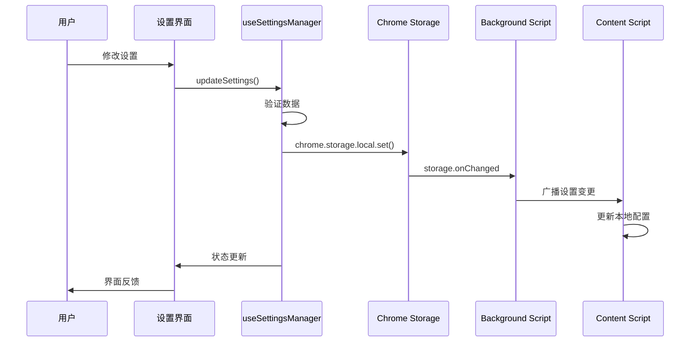
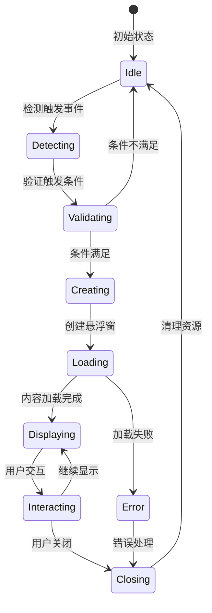
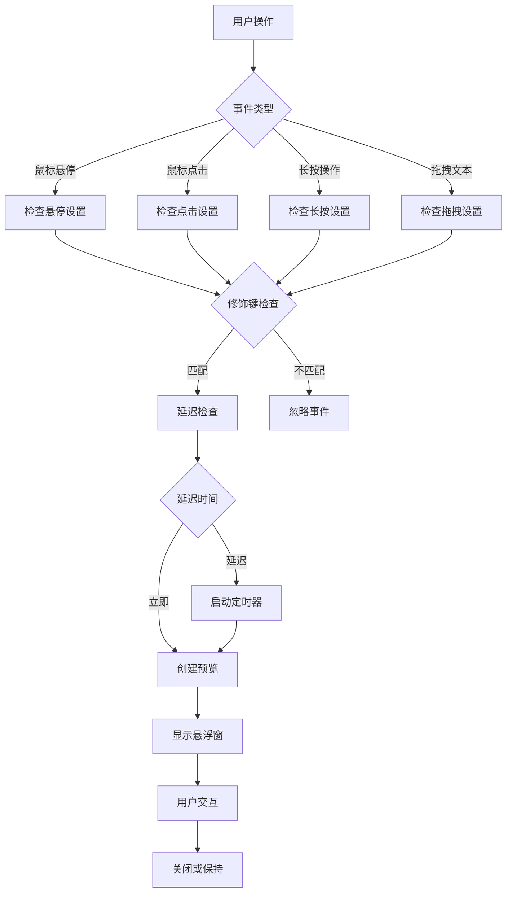
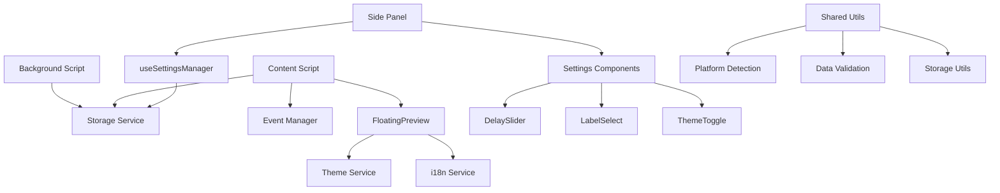

# HoverTabOfLink 技术架构文档 v2.0

**版本: 2.0**

**日期: 2025年1月15日**

## 1. 架构概述

### 1.1 整体架构设计

HoverTabOfLink 2.0 是一个基于现代化技术栈的浏览器扩展，采用 Manifest V3 标准构建。整体架构采用分层设计，确保高性能、可维护性和扩展性。

```
┌─────────────────────────────────────────────────────────────────────────────┐
│                           用户界面层 (UI Layer)                              │
├─────────────────────────────────────────────────────────────────────────────┤
│  ┌──────────────────┐  ┌──────────────────┐  ┌──────────────────────────────┐ │
│  │   Settings Panel │  │ Floating Preview │  │      Component Library       │ │
│  │   (侧边栏设置)    │  │   (悬浮预览窗)    │  │  (DelaySlider, LabelSelect)  │ │
│  │   - 触发方式配置  │  │   - 链接预览      │  │   - 可复用UI组件             │ │
│  │   - 延迟时间设置  │  │   - 文本搜索      │  │   - 主题适配                 │ │
│  │   - 主题语言切换  │  │   - 拖拽交互      │  │   - 国际化支持               │ │
│  └──────────────────┘  └──────────────────┘  └──────────────────────────────┘ │
├─────────────────────────────────────────────────────────────────────────────┤
│                          业务逻辑层 (Business Layer)                         │
├─────────────────────────────────────────────────────────────────────────────┤
│  ┌──────────────────┐  ┌──────────────────┐  ┌──────────────────────────────┐ │
│  │  Content Script  │  │  Settings Manager│  │      Event Controller        │ │
│  │   (内容脚本)      │  │   (设置管理器)    │  │      (事件控制器)            │ │
│  │   - 事件监听      │  │   - 配置验证      │  │   - 触发逻辑判断             │ │
│  │   - DOM操作       │  │   - 数据持久化    │  │   - 修饰键处理               │ │
│  │   - 消息通信      │  │   - 默认值管理    │  │   - 平台适配                 │ │
│  └──────────────────┘  └──────────────────┘  └──────────────────────────────┘ │
├─────────────────────────────────────────────────────────────────────────────┤
│                           服务层 (Service Layer)                            │
├─────────────────────────────────────────────────────────────────────────────┤
│  ┌──────────────────┐  ┌──────────────────┐  ┌──────────────────────────────┐ │
│  │ Background Worker│  │  I18n Service    │  │      Platform Utils          │ │
│  │   (后台服务)      │  │   (国际化服务)    │  │      (平台工具)              │ │
│  │   - 生命周期管理  │  │   - 多语言支持    │  │   - 操作系统检测             │ │
│  │   - 消息路由      │  │   - 动态切换      │  │   - 修饰键映射               │ │
│  │   - 权限管理      │  │   - 本地化适配    │  │   - 浏览器兼容性             │ │
│  └──────────────────┘  └──────────────────┘  └──────────────────────────────┘ │
├─────────────────────────────────────────────────────────────────────────────┤
│                           数据层 (Data Layer)                               │
├─────────────────────────────────────────────────────────────────────────────┤
│  ┌──────────────────┐  ┌──────────────────┐  ┌──────────────────────────────┐ │
│  │  Chrome Storage  │  │   Memory Cache   │  │      Validation Layer        │ │
│  │   (持久化存储)    │  │   (内存缓存)      │  │      (数据验证层)            │ │
│  │   - 用户设置      │  │   - 临时状态      │  │   - 类型检查                 │ │
│  │   - 应用状态      │  │   - 性能优化      │  │   - 数据迁移                 │ │
│  │   - 跨设备同步    │  │   - 快速访问      │  │   - 错误恢复                 │ │
│  └──────────────────┘  └──────────────────┘  └──────────────────────────────┘ │
└─────────────────────────────────────────────────────────────────────────────┘
```

### 1.2 技术栈详述

#### 核心技术栈
- **开发框架**: WXT v0.19+ (Next-generation Web Extension Framework)
- **前端框架**: React 18.2+ (Concurrent Features, Suspense)
- **类型系统**: TypeScript 5.3+ (严格模式，完整类型覆盖)
- **样式方案**: Tailwind CSS 3.4+ + shadcn/ui v0.8+
- **构建工具**: Vite 5.0+ (ESBuild, 热重载)
- **包管理**: pnpm 8.0+ (高效依赖管理)

#### 开发工具链
- **代码规范**: ESLint 8+ + Prettier 3+
- **Git钩子**: Husky + lint-staged
- **测试框架**: Vitest + React Testing Library
- **类型检查**: TypeScript Compiler + ts-node

#### 浏览器扩展技术
- **扩展标准**: Manifest V3 (最新规范)
- **权限模型**: 最小权限原则
- **API使用**: Chrome Extensions API + WebExtensions API
- **安全策略**: Content Security Policy (CSP)

### 1.3 项目结构与入口点

```
HoverTabOfLinkLatest/
├── entrypoints/                    # 扩展入口点
│   ├── background/                 # 后台脚本
│   │   └── index.ts               # Service Worker入口
│   ├── content/                   # 内容脚本
│   │   ├── index.ts              # Content Script入口
│   │   └── FloatingPreview/      # 悬浮预览组件
│   └── sidepanel/                # 侧边栏面板
│       ├── index.html            # 面板HTML入口
│       ├── main.tsx              # React应用入口
│       ├── App.tsx               # 主应用组件
│       └── components/           # UI组件库
├── lib/                          # 核心库文件
│   ├── settings.ts              # 设置类型定义
│   ├── utils.ts                 # 工具函数
│   └── i18n.ts                  # 国际化配置
├── hooks/                        # React Hooks
│   └── use-settings-manager.ts  # 设置管理Hook
└── wxt.config.ts                # WXT配置文件
```

## 2. 核心模块设计

### 2.1 Content Script 模块

**模块职责**: 网页内容交互的核心控制器

**核心功能**:
- **事件监听系统**: 统一管理鼠标、键盘、拖拽事件
- **DOM元素检测**: 智能识别链接元素和文本选择
- **触发条件判断**: 根据用户设置判断是否触发预览
- **消息通信**: 与Background Script和UI组件通信
- **性能优化**: 事件节流、内存管理、DOM操作优化

**技术实现**:
```typescript
// 事件管理器接口
interface EventManager {
  // 鼠标事件处理
  handleMouseEnter: (event: MouseEvent) => Promise<void>;
  handleMouseLeave: (event: MouseEvent) => void;
  handleClick: (event: MouseEvent) => Promise<void>;
  
  // 拖拽事件处理
  handleDragStart: (event: DragEvent) => void;
  handleDragEnd: (event: DragEvent) => void;
  
  // 键盘事件处理
  handleKeyDown: (event: KeyboardEvent) => void;
  handleKeyUp: (event: KeyboardEvent) => void;
  
  // 生命周期管理
  initialize: () => void;
  destroy: () => void;
}

// 触发条件检查器
interface TriggerChecker {
  checkHoverTrigger: (element: Element, modifiers: ModifierState) => boolean;
  checkClickTrigger: (element: Element, modifiers: ModifierState) => boolean;
  checkLongPressTrigger: (element: Element, duration: number) => boolean;
  checkDragTrigger: (selection: Selection) => boolean;
}
```

### 2.2 悬浮预览窗口 (FloatingPreview)

**模块职责**: 提供沉浸式的内容预览体验

**核心功能**:
- **动态窗口管理**: 智能定位、大小调整、层级管理
- **内容加载系统**: iframe安全加载、错误处理、加载状态
- **交互体验**: 拖拽移动、边缘吸附、手势操作
- **性能优化**: 虚拟化渲染、资源预加载、内存回收
- **安全机制**: CSP策略、XSS防护、域名验证

**组件架构**:
```typescript
// 悬浮窗口主组件
interface FloatingPreviewProps {
  // 内容配置
  url?: string;
  searchText?: string;
  searchEngine?: SearchEngine;
  
  // 位置和尺寸
  position: Position;
  size?: Size;
  constraints?: WindowConstraints;
  
  // 行为配置
  triggerMethod: TriggerMethod;
  autoClose?: boolean;
  draggable?: boolean;
  resizable?: boolean;
  
  // 事件回调
  onLoad?: (success: boolean) => void;
  onClose?: () => void;
  onMove?: (position: Position) => void;
  onResize?: (size: Size) => void;
}

// 窗口状态管理
interface WindowState {
  isVisible: boolean;
  isLoading: boolean;
  hasError: boolean;
  position: Position;
  size: Size;
  zIndex: number;
}
```

### 2.3 设置管理系统 (Settings Manager)

**模块职责**: 统一的配置管理和数据持久化

**核心功能**:
- **配置验证**: 类型检查、范围验证、兼容性检查
- **数据迁移**: 版本升级、配置迁移、向后兼容
- **实时同步**: 跨组件状态同步、存储监听
- **默认值管理**: 平台适配、智能默认值
- **性能优化**: 批量更新、防抖处理、缓存机制

**设置架构**:
```typescript
// 完整设置接口
interface Settings {
  // 触发配置
  triggerMethod: TriggerMethod;
  hoverDelay: number;        // 悬停延迟 (秒)
  longPressDelay: number;    // 长按延迟 (秒)
  customHoverDelay: number;  // 自定义悬停延迟 (秒)
  
  // 修饰键配置
  modifierKeys: ModifierKey[];
  
  // 界面配置
  theme: 'light' | 'dark' | 'system';
  language: SupportedLanguage;
  
  // 功能开关
  enableLinkPreview: boolean;
  enableTextSearch: boolean;
  enableDragSearch: boolean;
  
  // 高级配置
  searchEngine: SearchEngine;
  previewTimeout: number;
  maxWindowSize: Size;
  animationDuration: number;
}

// 设置管理器接口
interface SettingsManager {
  // 基础操作
  getSettings: () => Promise<Settings>;
  updateSettings: (partial: Partial<Settings>) => Promise<void>;
  resetSettings: () => Promise<void>;
  
  // 验证和迁移
  validateSettings: (settings: unknown) => Settings;
  migrateSettings: (oldVersion: string, newVersion: string) => Promise<void>;
  
  // 监听和同步
  onSettingsChange: (callback: (settings: Settings) => void) => () => void;
  syncSettings: () => Promise<void>;
}
```

### 2.4 国际化服务 (I18n Service)

**模块职责**: 多语言支持和本地化适配

**核心功能**:
- **多语言支持**: 12种主要语言的完整翻译
- **动态切换**: 运行时语言切换，无需重启
- **本地化适配**: 日期格式、数字格式、文本方向
- **延迟加载**: 按需加载语言包，减少初始包大小
- **回退机制**: 缺失翻译的智能回退策略

**实现架构**:
```typescript
// 支持的语言列表
type SupportedLanguage = 
  | 'en' | 'zh-CN' | 'zh-TW' | 'ja' | 'ko' 
  | 'es' | 'fr' | 'de' | 'it' | 'pt' 
  | 'ru' | 'ar';

// 翻译键值接口
interface TranslationKeys {
  // 通用
  common: {
    save: string;
    cancel: string;
    reset: string;
    confirm: string;
  };
  
  // 设置面板
  settings: {
    title: string;
    triggerMethod: string;
    hoverDelay: string;
    theme: string;
    language: string;
  };
  
  // 错误信息
  errors: {
    loadFailed: string;
    networkError: string;
    invalidUrl: string;
  };
}

// 国际化服务接口
interface I18nService {
  getCurrentLanguage: () => SupportedLanguage;
  setLanguage: (lang: SupportedLanguage) => Promise<void>;
  t: (key: keyof TranslationKeys, params?: Record<string, string>) => string;
  formatDate: (date: Date) => string;
  formatNumber: (num: number) => string;
}
```

## 3. 数据流与状态管理

### 3.1 设置数据流



### 3.2 预览窗口生命周期



### 3.3 事件处理流程



---

## 4. 数据存储架构

### 4.1 存储层次结构

```typescript
// 主要设置存储接口
interface StorageSchema {
  // 用户配置 (chrome.storage.local)
  settings: {
    // 触发方式配置
    triggerMethod: TriggerMethod;
    hoverDelay: number;        // 悬停延迟 (秒)
    longPressDelay: number;    // 长按延迟 (秒)
    customHoverDelay: number;  // 自定义悬停延迟 (秒)
    
    // 修饰键配置 (平台自适应)
    modifierKeys: ModifierKey[];
    
    // 界面配置
    theme: 'light' | 'dark' | 'system';
    language: SupportedLanguage;
    
    // 功能开关
    enableLinkPreview: boolean;
    enableTextSearch: boolean;
    enableDragSearch: boolean;
    
    // 搜索引擎配置
    searchEngine: SearchEngine;
  };
  
  // 应用状态 (chrome.storage.session)
  appState: {
    lastActiveTab?: number;
    windowPositions: Record<string, Position>;
    recentUrls: string[];
  };
  
  // 缓存数据 (内存)
  cache: {
    platformInfo?: PlatformInfo;
    compiledSettings?: CompiledSettings;
    performanceMetrics?: PerformanceMetrics;
  };
}
```

### 4.2 数据验证与迁移

```typescript
// 数据验证器
interface DataValidator {
  validateSettings: (data: unknown) => Settings | null;
  validatePartialSettings: (data: unknown) => Partial<Settings> | null;
  sanitizeUserInput: (input: string) => string;
  checkDataIntegrity: (data: StorageSchema) => boolean;
}

// 数据迁移器
interface DataMigrator {
  getCurrentVersion: () => string;
  migrateFromVersion: (fromVersion: string, data: unknown) => StorageSchema;
  createBackup: (data: StorageSchema) => Promise<void>;
  restoreFromBackup: () => Promise<StorageSchema | null>;
}
```

### 4.3 存储API封装

```typescript
// 统一存储接口
interface StorageService {
  // 设置操作
  getSettings: () => Promise<Settings>;
  setSettings: (settings: Partial<Settings>) => Promise<void>;
  resetSettings: () => Promise<void>;
  
  // 状态操作
  getAppState: () => Promise<AppState>;
  setAppState: (state: Partial<AppState>) => Promise<void>;
  
  // 缓存操作
  getCache: <T>(key: string) => T | null;
  setCache: <T>(key: string, value: T) => void;
  clearCache: () => void;
  
  // 监听器
  onSettingsChange: (callback: (settings: Settings) => void) => () => void;
  onStorageChange: (callback: (changes: StorageChanges) => void) => () => void;
}
```

## 5. 项目结构与组织

### 5.1 目录结构

```
HoverTabOfLinkLatest/
├── public/
│   ├── manifest.json          # 扩展清单文件 (Manifest V3)
│   └── icons/                 # 扩展图标资源
│       ├── icon-16.png
│       ├── icon-48.png
│       └── icon-128.png
├── src/
│   ├── background/            # Background Service Worker
│   │   └── index.ts           # 后台脚本入口
│   ├── content/               # Content Scripts
│   │   ├── index.ts           # 内容脚本入口
│   │   ├── content.ts         # 核心内容脚本逻辑
│   │   └── FloatingPreview/   # 悬浮预览组件
│   │       ├── index.tsx      # 悬浮窗主组件
│   │       └── styles.css     # 悬浮窗样式
│   ├── sidepanel/             # 侧边栏设置面板
│   │   ├── index.tsx          # 侧边栏入口
│   │   ├── App.tsx            # 主应用组件
│   │   └── components/        # 设置组件库
│   │       ├── DelaySlider.tsx    # 延迟滑块组件
│   │       ├── LabelSelect.tsx    # 标签选择组件
│   │       └── ThemeToggle.tsx    # 主题切换组件
│   ├── shared/                # 共享模块
│   │   ├── types/             # 类型定义
│   │   │   ├── settings.ts    # 设置相关类型
│   │   │   ├── events.ts      # 事件相关类型
│   │   │   └── platform.ts    # 平台相关类型
│   │   ├── hooks/             # 自定义 Hooks
│   │   │   ├── use-settings-manager.ts  # 设置管理 Hook
│   │   │   ├── use-theme.ts             # 主题管理 Hook
│   │   │   └── use-platform.ts          # 平台检测 Hook
│   │   ├── utils/             # 工具函数
│   │   │   ├── platform.ts    # 平台工具
│   │   │   ├── validation.ts  # 数据验证
│   │   │   └── storage.ts     # 存储工具
│   │   ├── constants/         # 常量定义
│   │   │   ├── settings.ts    # 设置常量
│   │   │   └── events.ts      # 事件常量
│   │   └── i18n/              # 国际化
│   │       ├── index.ts       # i18n 入口
│   │       ├── locales/       # 语言包
│   │       │   ├── zh-CN.ts   # 中文语言包
│   │       │   └── en-US.ts   # 英文语言包
│   │       └── types.ts       # i18n 类型定义
│   └── styles/                # 全局样式
│       ├── global.css         # 全局样式
│       ├── variables.css      # CSS 变量
│       └── themes/            # 主题样式
│           ├── light.css      # 明亮主题
│           └── dark.css       # 暗黑主题
├── .trae/                     # Trae AI 配置
│   └── documents/             # 项目文档
│       ├── productPRD.md      # 产品需求文档
│       └── 技术架构文档.md     # 技术架构文档
├── package.json               # 项目依赖配置
├── pnpm-lock.yaml            # pnpm 锁定文件
├── tsconfig.json             # TypeScript 配置
├── vite.config.ts            # Vite 构建配置
├── wxt.config.ts             # WXT 扩展配置
└── README.md                 # 项目说明文档
```

### 5.2 模块依赖关系



---

## 6. 组件设计规范

### 6.1 悬浮预览窗口设计

#### 设计原则
- **非侵入性**: 不干扰用户正常浏览体验
- **响应式**: 适配不同屏幕尺寸和设备
- **可访问性**: 支持键盘导航和屏幕阅读器
- **性能优先**: 快速加载和流畅交互

#### 技术实现
```typescript
interface FloatingPreviewProps {
  url: string;
  position: Position;
  theme: Theme;
  onClose: () => void;
  onResize?: (size: Size) => void;
}

interface FloatingPreviewState {
  loading: boolean;
  error: string | null;
  size: Size;
  isDragging: boolean;
  isResizing: boolean;
}
```

#### 核心特性
- **智能定位**: 自动避免超出视窗边界
- **平滑动画**: 使用 CSS transitions 和 transforms
- **内容隔离**: Shadow DOM 或 iframe 隔离样式
- **资源管理**: 自动清理和内存优化

### 6.2 设置面板组件设计

#### 设计原则
- **直观易用**: 清晰的视觉层次和操作流程
- **即时反馈**: 设置变更立即生效并提供反馈
- **数据持久**: 自动保存用户设置
- **错误处理**: 优雅的错误提示和恢复机制

#### 组件架构
```typescript
// 设置面板主组件
interface SettingsPanelProps {
  initialSettings: Settings;
  onSettingsChange: (settings: Partial<Settings>) => void;
  theme: Theme;
  language: Language;
}

// 通用设置项组件
interface SettingItemProps<T> {
  label: string;
  value: T;
  onChange: (value: T) => void;
  description?: string;
  disabled?: boolean;
  validation?: (value: T) => string | null;
}
```

#### 组件库
- **DelaySlider**: 延迟时间滑块选择器
- **LabelSelect**: 带标签的选择器组件
- **ThemeToggle**: 主题切换开关
- **ModifierKeySelector**: 修饰键选择器
- **SearchEngineSelector**: 搜索引擎选择器

---

## 7. 性能优化策略

### 7.1 Content Script 性能优化

#### 启动优化
```typescript
// 延迟初始化策略
class ContentScriptManager {
  private initialized = false;
  private eventQueue: Event[] = [];
  
  async initialize() {
    if (this.initialized) return;
    
    // 异步加载核心模块
    const [settings, platform] = await Promise.all([
      this.loadSettings(),
      this.detectPlatform()
    ]);
    
    this.setupEventListeners(settings, platform);
    this.processQueuedEvents();
    this.initialized = true;
  }
}
```

#### 事件处理优化
- **事件节流**: 限制高频事件的处理频率
- **事件委托**: 使用事件委托减少监听器数量
- **条件检查**: 早期退出不符合条件的事件
- **异步处理**: 将耗时操作移至 Web Worker

### 7.2 悬浮窗性能优化

#### 渲染优化
```typescript
// 虚拟化长列表
interface VirtualizedListProps {
  items: any[];
  itemHeight: number;
  containerHeight: number;
  renderItem: (item: any, index: number) => React.ReactNode;
}

// 图片懒加载
const LazyImage: React.FC<ImageProps> = ({ src, alt, ...props }) => {
  const [loaded, setLoaded] = useState(false);
  const imgRef = useRef<HTMLImageElement>(null);
  
  useEffect(() => {
    const observer = new IntersectionObserver(
      ([entry]) => {
        if (entry.isIntersecting) {
          setLoaded(true);
          observer.disconnect();
        }
      },
      { threshold: 0.1 }
    );
    
    if (imgRef.current) {
      observer.observe(imgRef.current);
    }
    
    return () => observer.disconnect();
  }, []);
  
  return (
    
  );
};
```

#### 内存管理
- **组件卸载**: 及时清理事件监听器和定时器
- **缓存策略**: LRU 缓存已加载的内容
- **资源释放**: 自动释放不再使用的资源

### 7.3 存储性能优化

#### 批量操作
```typescript
class StorageOptimizer {
  private pendingWrites = new Map<string, any>();
  private writeTimer: NodeJS.Timeout | null = null;
  
  queueWrite(key: string, value: any) {
    this.pendingWrites.set(key, value);
    
    if (this.writeTimer) {
      clearTimeout(this.writeTimer);
    }
    
    this.writeTimer = setTimeout(() => {
      this.flushWrites();
    }, 100); // 100ms 批量写入
  }
  
  private async flushWrites() {
    if (this.pendingWrites.size === 0) return;
    
    const data = Object.fromEntries(this.pendingWrites);
    await chrome.storage.local.set(data);
    
    this.pendingWrites.clear();
    this.writeTimer = null;
  }
}
```

#### 数据压缩
- **JSON 压缩**: 移除不必要的空白字符
- **增量更新**: 仅存储变化的数据
- **过期清理**: 定期清理过期数据

---

## 8. 安全与隐私保护

### 8.1 内容安全策略 (CSP)

```json
{
  "content_security_policy": {
    "extension_pages": "script-src 'self'; object-src 'self'; frame-src 'self' https:;",
    "sandbox": "sandbox allow-scripts allow-forms allow-popups allow-modals; script-src 'self' 'unsafe-inline' 'unsafe-eval'; child-src 'self';"
  }
}
```

### 8.2 权限管理

#### 最小权限原则
```json
{
  "permissions": [
    "storage",
    "sidePanel"
  ],
  "host_permissions": [
    "<all_urls>"
  ],
  "optional_permissions": [
    "tabs"
  ]
}
```

#### 动态权限请求
```typescript
class PermissionManager {
  async requestOptionalPermission(permission: string): Promise<boolean> {
    try {
      const granted = await chrome.permissions.request({
        permissions: [permission]
      });
      
      if (granted) {
        console.log(`Permission ${permission} granted`);
      } else {
        console.warn(`Permission ${permission} denied`);
      }
      
      return granted;
    } catch (error) {
      console.error('Permission request failed:', error);
      return false;
    }
  }
}
```

### 8.3 数据保护

#### 敏感数据处理
- **数据最小化**: 仅收集必要的用户数据
- **本地存储**: 用户数据仅存储在本地
- **数据加密**: 敏感配置使用加密存储
- **隐私透明**: 清晰的隐私政策和数据使用说明

---

## 9. 测试与质量保证

### 9.1 测试架构

```typescript
// 测试工具配置
interface TestConfig {
  framework: 'Jest' | 'Vitest';
  testEnvironment: 'jsdom' | 'node';
  setupFiles: string[];
  coverageThreshold: {
    global: {
      branches: number;
      functions: number;
      lines: number;
      statements: number;
    };
  };
}

// 测试工具类
class TestUtils {
  static mockChromeAPI() {
    global.chrome = {
      storage: {
        local: {
          get: jest.fn(),
          set: jest.fn(),
          remove: jest.fn()
        }
      },
      runtime: {
        sendMessage: jest.fn(),
        onMessage: {
          addListener: jest.fn()
        }
      }
    };
  }
  
  static createMockSettings(): Settings {
    return {
      triggerMethod: 'hover',
      hoverDelay: 0.5,
      longPressDelay: 1.0,
      theme: 'system',
      language: 'zh-CN'
    };
  }
}
```

### 9.2 测试策略

#### 单元测试
- **组件测试**: React 组件的渲染和交互
- **Hook 测试**: 自定义 Hook 的逻辑验证
- **工具函数测试**: 纯函数的输入输出验证
- **类型测试**: TypeScript 类型定义的正确性

#### 集成测试
- **模块集成**: 不同模块间的协作测试
- **API 集成**: Chrome Extension API 的调用测试
- **数据流测试**: 完整数据流的端到端验证

#### 端到端测试
```typescript
// Playwright E2E 测试示例
import { test, expect } from '@playwright/test';

test('悬浮预览功能测试', async ({ page }) => {
  // 加载测试页面
  await page.goto('https://example.com');
  
  // 悬停在链接上
  await page.hover('a[href]');
  
  // 等待悬浮窗出现
  await expect(page.locator('.floating-preview')).toBeVisible();
  
  // 验证预览内容
  const preview = page.locator('.floating-preview iframe');
  await expect(preview).toHaveAttribute('src');
});
```

### 9.3 质量保证流程

#### 代码质量
- **ESLint**: 代码风格和潜在问题检查
- **Prettier**: 代码格式化
- **TypeScript**: 静态类型检查
- **Husky**: Git hooks 自动化检查

#### 性能监控
```typescript
class PerformanceMonitor {
  private metrics = new Map<string, number[]>();
  
  startTiming(label: string): () => void {
    const start = performance.now();
    
    return () => {
      const duration = performance.now() - start;
      
      if (!this.metrics.has(label)) {
        this.metrics.set(label, []);
      }
      
      this.metrics.get(label)!.push(duration);
      
      // 性能阈值检查
      if (duration > 100) {
        console.warn(`Performance warning: ${label} took ${duration}ms`);
      }
    };
  }
  
  getAverageTime(label: string): number {
     const times = this.metrics.get(label) || [];
     return times.reduce((sum, time) => sum + time, 0) / times.length;
   }
 }
 ```

---

## 10. 部署与发布

### 10.1 构建流程

#### 开发环境
```bash
# 安装依赖
pnpm install

# 启动开发服务器
pnpm run dev

# 类型检查
pnpm run type-check

# 代码检查
pnpm run lint

# 运行测试
pnpm run test
```

#### 生产构建
```bash
# 构建生产版本
pnpm run build

# 构建并打包扩展
pnpm run build:extension

# 生成发布包
pnpm run package
```

#### 构建配置
```typescript
// wxt.config.ts
export default defineConfig({
  manifest: {
    name: 'HoverTab - 链接预览扩展',
    version: '2.0.0',
    description: '智能链接预览和文本搜索工具',
    permissions: ['storage', 'sidePanel'],
    host_permissions: ['<all_urls>'],
    content_scripts: [{
      matches: ['<all_urls>'],
      js: ['content/index.js'],
      run_at: 'document_idle'
    }]
  },
  
  // 构建优化
  vite: {
    build: {
      minify: 'terser',
      sourcemap: false,
      rollupOptions: {
        output: {
          manualChunks: {
            'react-vendor': ['react', 'react-dom'],
            'utils': ['src/shared/utils']
          }
        }
      }
    }
  }
});
```

### 10.2 版本管理

#### 语义化版本控制
- **主版本号 (Major)**: 不兼容的 API 变更
- **次版本号 (Minor)**: 向下兼容的功能性新增
- **修订号 (Patch)**: 向下兼容的问题修正

#### 发布流程
```bash
# 版本更新
npm version patch|minor|major

# 生成变更日志
pnpm run changelog

# 构建发布版本
pnpm run build:release

# 发布到 Chrome Web Store
pnpm run publish:chrome

# 发布到 Firefox Add-ons
pnpm run publish:firefox
```

### 10.3 持续集成/持续部署 (CI/CD)

#### GitHub Actions 配置
```yaml
# .github/workflows/ci.yml
name: CI/CD Pipeline

on:
  push:
    branches: [main, develop]
  pull_request:
    branches: [main]

jobs:
  test:
    runs-on: ubuntu-latest
    steps:
      - uses: actions/checkout@v4
      - uses: pnpm/action-setup@v2
        with:
          version: 8
      - uses: actions/setup-node@v4
        with:
          node-version: '18'
          cache: 'pnpm'
      
      - run: pnpm install
      - run: pnpm run type-check
      - run: pnpm run lint
      - run: pnpm run test
      - run: pnpm run build
  
  release:
    needs: test
    runs-on: ubuntu-latest
    if: github.ref == 'refs/heads/main'
    steps:
      - uses: actions/checkout@v4
      - run: pnpm run build:release
      - uses: actions/upload-artifact@v4
        with:
          name: extension-build
          path: dist/
```

---

## 11. 维护与监控

### 11.1 错误监控

#### 错误收集系统
```typescript
class ErrorReporter {
  private static instance: ErrorReporter;
  private errorQueue: ErrorReport[] = [];
  
  static getInstance(): ErrorReporter {
    if (!ErrorReporter.instance) {
      ErrorReporter.instance = new ErrorReporter();
    }
    return ErrorReporter.instance;
  }
  
  reportError(error: Error, context?: Record<string, any>) {
    const report: ErrorReport = {
      message: error.message,
      stack: error.stack,
      timestamp: Date.now(),
      userAgent: navigator.userAgent,
      url: window.location.href,
      context
    };
    
    this.errorQueue.push(report);
    this.flushErrors();
  }
  
  private async flushErrors() {
    if (this.errorQueue.length === 0) return;
    
    try {
      // 发送错误报告到监控服务
      await this.sendErrorReports(this.errorQueue);
      this.errorQueue = [];
    } catch (e) {
      console.error('Failed to send error reports:', e);
    }
  }
}

// 全局错误处理
window.addEventListener('error', (event) => {
  ErrorReporter.getInstance().reportError(event.error, {
    filename: event.filename,
    lineno: event.lineno,
    colno: event.colno
  });
});

window.addEventListener('unhandledrejection', (event) => {
  ErrorReporter.getInstance().reportError(
    new Error(event.reason),
    { type: 'unhandledrejection' }
  );
});
```

### 11.2 性能监控

#### 关键指标监控
```typescript
interface PerformanceMetrics {
  // 启动性能
  contentScriptLoadTime: number;
  settingsLoadTime: number;
  
  // 交互性能
  hoverResponseTime: number;
  previewLoadTime: number;
  settingsUpdateTime: number;
  
  // 资源使用
  memoryUsage: number;
  domNodeCount: number;
  eventListenerCount: number;
}

class PerformanceTracker {
  private metrics: PerformanceMetrics = {
    contentScriptLoadTime: 0,
    settingsLoadTime: 0,
    hoverResponseTime: 0,
    previewLoadTime: 0,
    settingsUpdateTime: 0,
    memoryUsage: 0,
    domNodeCount: 0,
    eventListenerCount: 0
  };
  
  trackMetric(key: keyof PerformanceMetrics, value: number) {
    this.metrics[key] = value;
    
    // 性能阈值检查
    this.checkPerformanceThresholds(key, value);
  }
  
  private checkPerformanceThresholds(key: string, value: number) {
    const thresholds = {
      contentScriptLoadTime: 100,
      hoverResponseTime: 50,
      previewLoadTime: 500,
      memoryUsage: 50 * 1024 * 1024 // 50MB
    };
    
    if (thresholds[key] && value > thresholds[key]) {
      console.warn(`Performance threshold exceeded: ${key} = ${value}`);
      
      // 发送性能警告
      this.reportPerformanceIssue(key, value, thresholds[key]);
    }
  }
}
```

### 11.3 用户反馈系统

#### 反馈收集
```typescript
interface UserFeedback {
  type: 'bug' | 'feature' | 'improvement';
  severity: 'low' | 'medium' | 'high' | 'critical';
  description: string;
  steps?: string[];
  expectedBehavior?: string;
  actualBehavior?: string;
  browserInfo: {
    name: string;
    version: string;
    os: string;
  };
  extensionVersion: string;
  timestamp: number;
}

class FeedbackCollector {
  async submitFeedback(feedback: Omit<UserFeedback, 'timestamp' | 'browserInfo' | 'extensionVersion'>) {
    const completeFeedback: UserFeedback = {
      ...feedback,
      timestamp: Date.now(),
      browserInfo: await this.getBrowserInfo(),
      extensionVersion: chrome.runtime.getManifest().version
    };
    
    // 存储到本地，等待同步
    await chrome.storage.local.set({
      [`feedback_${completeFeedback.timestamp}`]: completeFeedback
    });
    
    // 尝试立即发送
    try {
      await this.sendFeedback(completeFeedback);
    } catch (error) {
      console.log('Feedback will be sent later:', error);
    }
  }
}
```

### 11.4 自动更新机制

#### 更新检查
```typescript
class UpdateManager {
  private currentVersion: string;
  
  constructor() {
    this.currentVersion = chrome.runtime.getManifest().version;
  }
  
  async checkForUpdates(): Promise<UpdateInfo | null> {
    try {
      const response = await fetch('https://api.example.com/extension/version');
      const { latestVersion, updateNotes, criticalUpdate } = await response.json();
      
      if (this.isNewerVersion(latestVersion, this.currentVersion)) {
        return {
          version: latestVersion,
          notes: updateNotes,
          critical: criticalUpdate,
          downloadUrl: `https://chrome.google.com/webstore/detail/${chrome.runtime.id}`
        };
      }
      
      return null;
    } catch (error) {
      console.error('Update check failed:', error);
      return null;
    }
  }
  
  private isNewerVersion(latest: string, current: string): boolean {
    const latestParts = latest.split('.').map(Number);
    const currentParts = current.split('.').map(Number);
    
    for (let i = 0; i < Math.max(latestParts.length, currentParts.length); i++) {
      const latestPart = latestParts[i] || 0;
      const currentPart = currentParts[i] || 0;
      
      if (latestPart > currentPart) return true;
      if (latestPart < currentPart) return false;
    }
    
    return false;
  }
}
```

---

## 12. 总结与展望

### 12.1 架构优势

- **模块化设计**: 清晰的模块边界，便于维护和扩展
- **类型安全**: 全面的 TypeScript 类型定义，减少运行时错误
- **性能优化**: 多层次的性能优化策略，确保流畅体验
- **跨平台兼容**: 智能的平台检测和适配机制
- **可扩展性**: 插件化的架构设计，支持功能扩展

### 12.2 技术创新点

- **智能触发**: 基于用户行为的智能预览触发
- **自适应界面**: 响应式设计适配不同设备和屏幕
- **性能监控**: 实时性能监控和自动优化
- **无障碍访问**: 完整的可访问性支持
- **国际化**: 多语言支持和本地化适配

### 12.3 未来发展方向

#### 功能扩展
- **AI 增强**: 集成 AI 技术提供智能内容摘要
- **协作功能**: 支持团队协作和内容分享
- **云同步**: 跨设备设置和数据同步
- **插件生态**: 开放 API 支持第三方插件

#### 技术演进
- **WebAssembly**: 使用 WASM 优化性能关键模块
- **Service Worker**: 更好的离线支持和缓存策略
- **Web Components**: 标准化组件复用
- **Progressive Web App**: PWA 技术增强用户体验

### 12.4 维护计划

- **定期更新**: 每月发布功能更新和问题修复
- **安全审计**: 季度安全审计和漏洞修复
- **性能优化**: 持续性能监控和优化
- **用户反馈**: 积极响应用户反馈和建议

---

**文档版本**: 2.0  
**最后更新**: 2024年12月  
**维护团队**: HoverTab 开发团队
```
