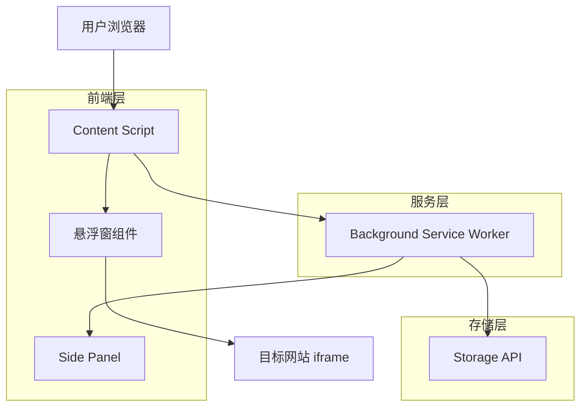
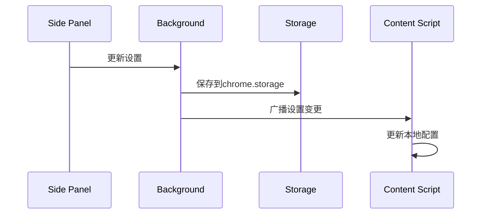
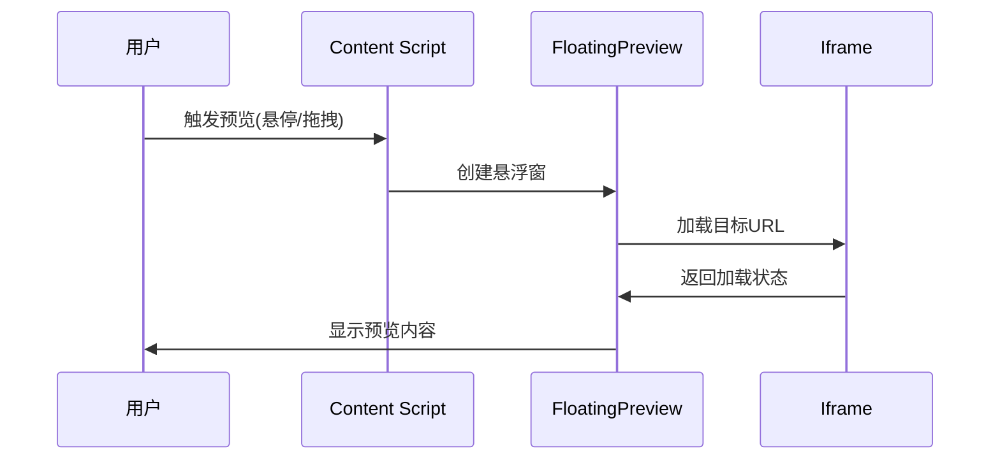

# HoverTabOfLink 技术架构文档

**版本: 1.0**

**日期: 2025年1月15日**

## 1. 架构设计



## 2. 技术描述

* 前端: React\@18 + TypeScript\@5 + WXT框架

* 样式: CSS Modules + Tailwind CSS

* 构建工具: Vite (WXT内置)

* 扩展规范: Manifest V3

* 包管理: pnpm

## 3. 路由定义

| 路由         | 用途                          |
| ---------- | --------------------------- |
| /sidepanel | 设置面板主页，包含链接预览设置、拖拽文字设置、语言设置 |

## 4. 核心模块设计

### 4.1 Content Script 模块

**职责**: 页面内容交互和悬浮窗管理

**核心功能**:

* 监听链接交互事件（悬停、拖拽、快捷键）

* 创建和管理悬浮窗组件

* 处理文本拖拽功能

* 与Background通信获取设置

### 4.2 悬浮窗组件 (FloatingPreview)

**组件结构**:

```
FloatingPreview/
├── Header/
│   ├── UrlDisplay
│   └── ActionButtons (Pin, Refresh, OpenTab, Close)
├── Content/
│   ├── IframeContainer
│   └── ResizeHandles (Left, Right)
└── Footer/
    ├── HeightResizeHandle
    └── CornerResizeHandles (BottomLeft, BottomRight)
```

**状态管理**:

* 窗口位置和尺寸

* 固定状态

* 主题配置

* 加载状态

### 4.3 设置面板 (Side Panel)

**组件结构**:

```
SidePanel/
├── TabNavigation (链接预览、拖拽文字、语言)
├── LinkPreviewSettings/
│   ├── TriggerMethodSelect
│   ├── HoverDelaySlider
│   ├── WindowSizeOptions
│   ├── WindowPositionSelect
│   ├── ThemeSelector
│   └── BackgroundOpacitySlider
├── DragTextSettings/
│   ├── SearchEngineSelect
│   ├── AutoOpenLinkToggle
│   └── DisabledSitesTextarea
└── LanguageSettings/
    └── LanguageSelect
```

### 4.4 Background Service Worker

**职责**: 扩展生命周期管理和数据协调

**核心功能**:

* 管理Side Panel API

* 处理存储操作

* 扩展安装和更新逻辑

* Content Script与Side Panel间的消息中转

## 5. 数据流设计

### 5.1 设置数据流



### 5.2 预览窗口数据流



## 6. 存储方案

### 6.1 设置存储结构

```typescript
interface ExtensionSettings {
  linkPreview: {
    triggerMethod: 'drag' | 'hover' | 'altClick';
    customShortcut: 'alt' | 'ctrl' | 'shift';
    hoverDelay: number; // 100-2000ms
    windowSize: 'lastSize' | 'default' | 'adaptive';
    windowPosition: 'followMouse' | 'center' | 'topRight';
    theme: 'light' | 'dark' | 'blue' | 'red' | 'yellow' | 'green' | 'custom';
    customTheme?: {
      backgroundColor: string;
      textColor: string;
    };
    backgroundOpacity: number; // 0-100
  };
  dragText: {
    searchEngine: 'bing' | 'google' | 'baidu';
    autoOpenLink: boolean;
    disabledSites: string[];
  };
  language: 'zh-CN' | 'en-US';
  windowState: {
    lastWidth: number;
    lastHeight: number;
  };
}
```

### 6.2 存储API使用

* **chrome.storage.sync**: 用户设置同步

* **chrome.storage.local**: 窗口状态等本地数据

* **chrome.storage.session**: 临时会话数据

## 7. 文件目录结构

```
HoverTabOfLink/
├── entrypoints/
│   ├── background.ts              # Background Service Worker
│   ├── content.ts                 # Content Script 入口
│   └── sidepanel/                 # Side Panel 页面
│       ├── index.html
│       ├── main.tsx
│       └── App.tsx
├── components/                    # React 组件
│   ├── FloatingPreview/
│   │   ├── index.tsx
│   │   ├── Header.tsx
│   │   ├── Content.tsx
│   │   ├── Footer.tsx
│   │   └── ResizeHandles.tsx
│   ├── SidePanel/
│   │   ├── index.tsx
│   │   ├── TabNavigation.tsx
│   │   ├── LinkPreviewSettings.tsx
│   │   ├── DragTextSettings.tsx
│   │   └── LanguageSettings.tsx
│   └── common/                    # 通用组件
│       ├── Slider.tsx
│       ├── Select.tsx
│       └── ColorPicker.tsx
├── hooks/                         # React Hooks
│   ├── useSettings.ts
│   ├── useStorage.ts
│   └── useFloatingWindow.ts
├── utils/                         # 工具函数
│   ├── storage.ts
│   ├── messaging.ts
│   ├── dom.ts
│   └── constants.ts
├── types/                         # TypeScript 类型定义
│   ├── settings.ts
│   ├── messages.ts
│   └── window.ts
├── styles/                        # 样式文件
│   ├── globals.css
│   ├── floating-preview.css
│   └── sidepanel.css
├── assets/                        # 静态资源
│   └── icons/
└── public/                        # 公共资源
    └── icon/
```

## 8. 组件设计规范

### 8.1 悬浮窗组件设计

**FloatingPreview 组件**:

* 使用 React Portal 渲染到页面根节点

* 支持拖拽调整大小和位置

* 响应式设计，适配不同屏幕尺寸

* 主题切换支持CSS变量

**关键特性**:

* 防止与页面样式冲突（Shadow DOM或CSS隔离）

* 高性能渲染（虚拟化长列表等）

* 无障碍访问支持（ARIA标签）

### 8.2 设置面板组件设计

**SidePanel 组件**:

* 模块化设计，每个设置项独立组件

* 实时预览设置效果

* 表单验证和错误处理

* 国际化支持

## 9. 性能优化策略

### 9.1 Content Script 优化

* 事件委托减少监听器数量

* 防抖处理高频事件

* 懒加载悬浮窗组件

* 内存泄漏防护

### 9.2 悬浮窗优化

* iframe 预加载机制

* 虚拟滚动优化长内容

* CSS transform 优化动画性能

* 图片懒加载

### 9.3 存储优化

* 设置变更批量提交

* 本地缓存减少存储API调用

* 数据压缩存储

## 10. 安全考虑

### 10.1 Content Security Policy

* 严格的CSP策略

* iframe 沙箱属性

* 防止XSS攻击

### 10.2 权限管理

* 最小权限原则

* 敏感操作用户确认

* 数据加密存储

## 11. 测试策略

### 11.1 单元测试

* React组件测试（Jest + React Testing Library）

* 工具函数测试

* Hook测试

### 11.2 集成测试

* Chrome扩展API模拟测试

* 跨组件交互测试

* 存储功能测试

### 11.3 端到端测试

* Puppeteer自动化测试

* 多浏览器兼容性测试

* 性能基准测试

